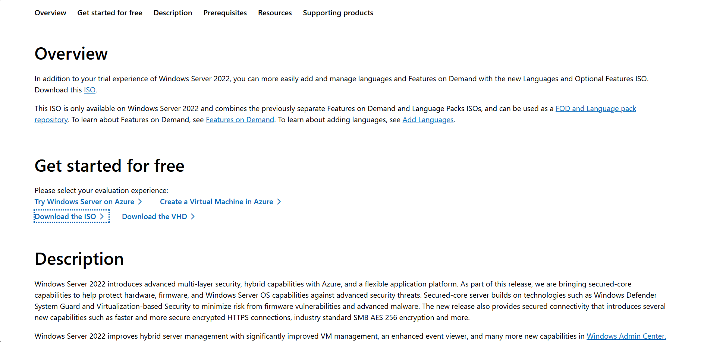

# Lab 1 — Installing Windows Server 2022 and Preparing AD Lab

## Overview
In this lab, we will install **Windows Server 2022** inside a **VirtualBox virtual machine**.  
This server will later be used for **Active Directory**, **Group Policy**, and domain management.  
We will also prepare the essential tools for our home lab.

---

## Step 1 — Download VirtualBox
Download VirtualBox from the official website:

[VirtualBox Downloads](https://www.virtualbox.org/wiki/Downloads)

Since this lab is on a Windows PC, select **Windows hosts**.

**Screenshot:**  

---

## Step 2 — Download Windows Server 2022
Download Windows Server 2022 from the Microsoft Evaluation Center:

[Windows Server 2022 Evaluation](https://www.microsoft.com/en-us/evalcenter/evaluate-windows-server-2022)

To access the free trial, register your information.  
The trial lasts **180 days**.

**Screenshot:**  

---

## Step 3 — Disk Preparation / Sanitization
Before installing the OS, perform disk preparation:

1. Backup any important files on your machine.  
2. Create a new virtual hard drive in VirtualBox.  
3. Format the virtual hard drive to ensure a clean installation.

**Screenshot:**  

---

## Step 4 — Create a New Virtual Machine
Open VirtualBox and click **New**:

- Name: `Server2022`  
- Type: `Microsoft Windows`  
- Version: `Windows 2022 (64-bit)`  
- Memory: `4096 MB` (or higher if available)  
- Create a new virtual hard disk (50GB recommended)

**Screenshot:**  

---

## Step 5 — Attach Windows Server ISO and Start VM
1. Go to **Settings → Storage → Empty → Choose disk file**  
2. Select the downloaded Server 2022 ISO  
3. Start the virtual machine

**Screenshot:**  

---

## Step 6 — Install Windows Server 2022
1. Select language, time, and keyboard layout  
2. Click **Install Now**  
3. Choose **Windows Server 2022 Standard (Desktop Experience)**  
4. Accept license terms and choose **Custom: Install Windows only**  
5. Select the virtual hard drive and click **Next**  

**Screenshot:**  

---

## Step 7 — Set Administrator Password
After installation, set the **Administrator password**.  

**Screenshot:**  

---

## Step 8 — Login and Confirm Installation
Press **Ctrl + Alt + Delete** in VirtualBox, log in with your password.  
Check that the server desktop loads successfully.

**Screenshot:**  

---

## Lab Complete
You have successfully installed **Windows Server 2022** in VirtualBox and prepared the environment for Active Directory.  

Next: **Lab 2 — Renaming the Server and Installing Active Directory**
