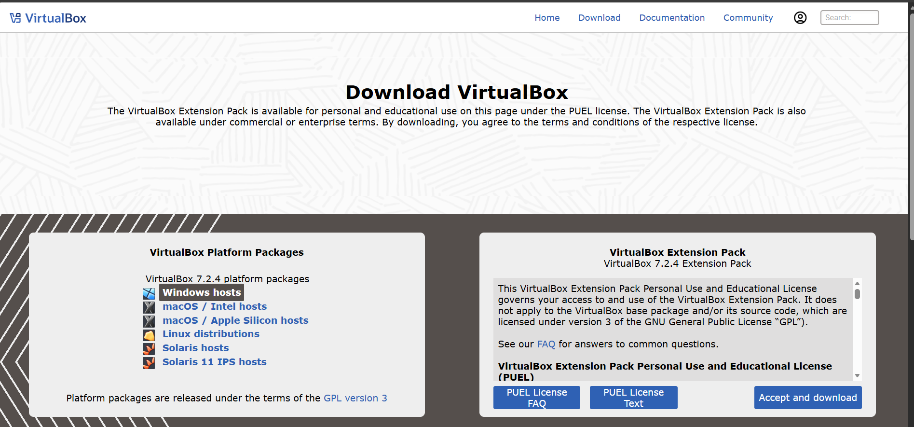
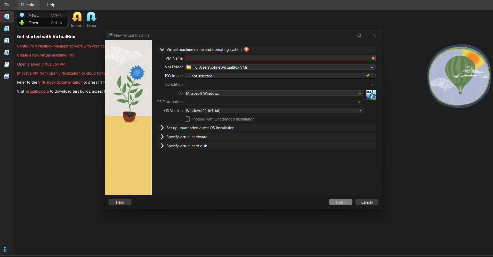
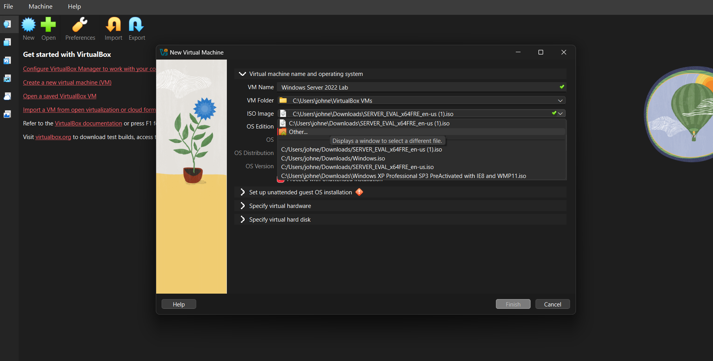
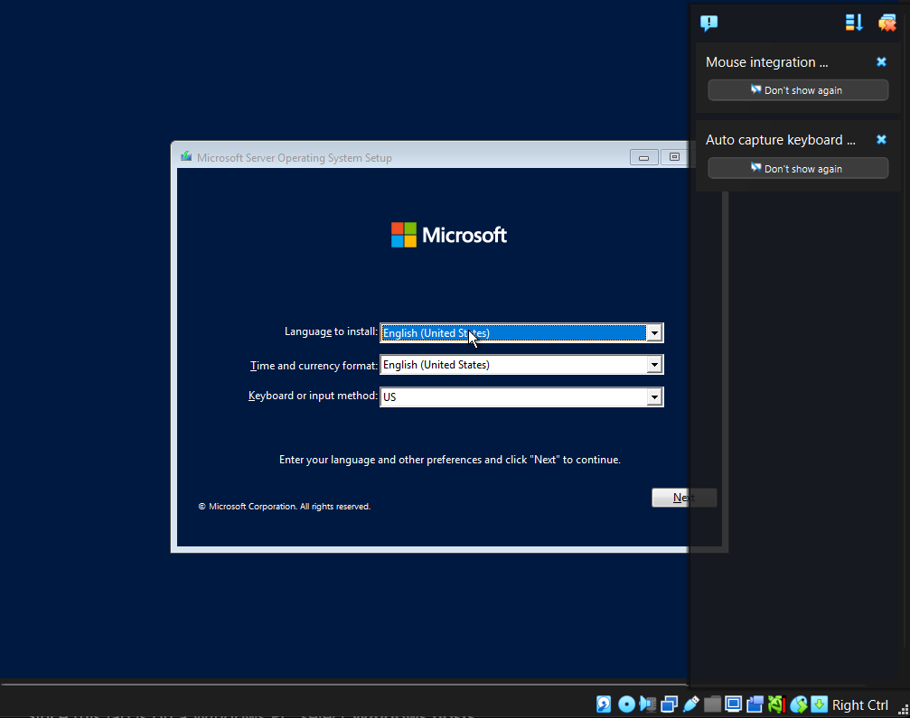
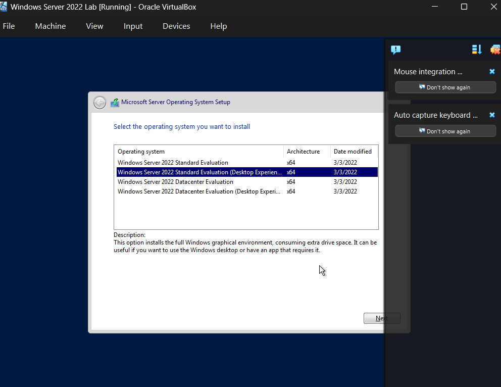
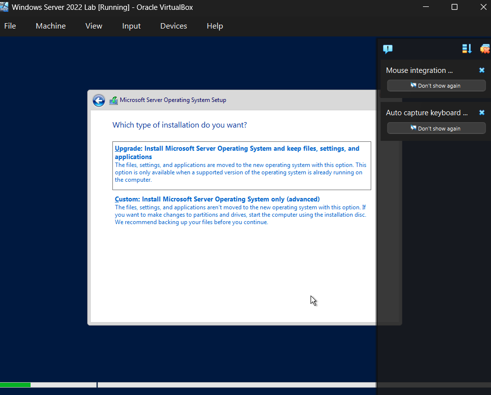

# Lab 1 — Installing Windows Server 2022 and Preparing AD Lab

## Overview
In this lab, we will install **Windows Server 2022** inside a **VirtualBox virtual machine**.  
This server will later be used for **Active Directory**, **Group Policy**, and domain management.  
We will also prepare the essential tools for our home lab.

---

## Step 1 — Download VirtualBox
Download VirtualBox from the official website:

[VirtualBox Downloads](https://www.virtualbox.org/wiki/Downloads)

Since this lab is on a Windows PC, select **Windows hosts**.

**Screenshot:**  

---

## Step 2 — Download Windows Server 2022
Download Windows Server 2022 from the Microsoft Evaluation Center:

[Windows Server 2022 Evaluation](https://www.microsoft.com/en-us/evalcenter/evaluate-windows-server-2022)

To access the free trial, register your information.  
The trial lasts **180 days**.
After filling our information, we can finally download the ISO which will be the 64-bit edition (English).

**Screenshot:**  

---

## Step 3 — Disk Preparation / Sanitization
Before installing the OS, perform disk preparation:

1. Backup any important files on your machine.  
2. Create a new virtual hard drive in VirtualBox.  
3. Format the virtual hard drive to ensure a clean installation.

**Screenshot:**  

---

## Step 4 — Install Windows server
1. Boot up the virtual machine by clicking the **Start** button.  
   A prompt for the Microsoft Server Operating System Setup will appear.  
   Click **Next**, then select **Install Now** to begin the installation process.

2. In the operating system selection screen, choose  
   **Windows Server 2022 Standard Evaluation (Desktop Experience)**, then click **Next** to continue.

3. Accept the license terms and click **Next**.  
   When prompted to choose the type of installation, select **Custom** to proceed.

**Screenshot:**  

---

## Step 5 — Set Administrator Password
After installation, set the **Administrator password**.  

**Screenshot:**  

---

## Lab Complete
You have successfully installed **Windows Server 2022** in VirtualBox and prepared the environment for Active Directory.  

Next: **Lab 2 — Renaming the Server and Installing Active Directory**
