# Lab 10 – Lab 10 Installing and Deploying Software with PDQ

## Overview
This repository documents my home lab experience focused on Installing and Deploying Software with PDQ using VirtualBox. The lab involves setting up PDQ Deploy and PDQ Inventory to automate software deployment and manage system configurations across multiple virtual machines.

## Objectives
Learn PDQ Deploy: Explore how to automate the installation of software applications across multiple virtual machines.
Understand PDQ Inventory: Set up and configure PDQ Inventory for system management and monitoring.
Network Configuration: Use VirtualBox to simulate a network environment with different configurations and virtual machines.

---

## Documentation
In this home lab, I will demonstrate how to install PDQ Deploy, create software packages, and deploy them. We will be primarily using Windows Server 2022 for this lab environment. To begin, select Devices at the top of the VirtualBox menu, then choose Insert Guest Additions CD Image.

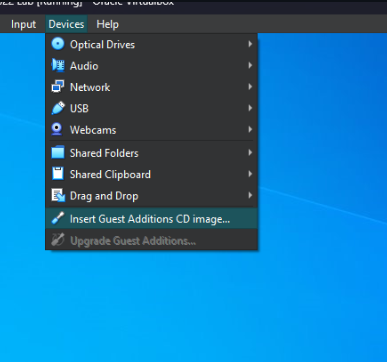

Now lets open up File Explore and we see that CD Drive (D) VirtualBox Guest additions has been added.

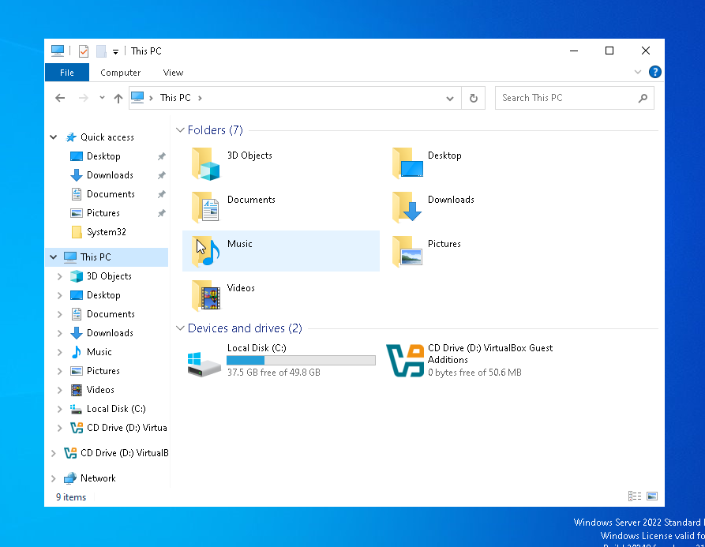

Double-click on VirtualBox Guest and click Next until you reach the Install option. Select Install, then choose Reboot now and click Finish. Once you log back into your Windows Server 2022 account, right-click on the gray folder icon in the system tray and select Shared Folders Settings....

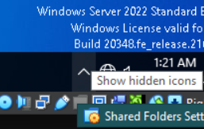

After selecting the SimoTech Lab folder, right-click on the disk icon at the bottom of the screen and select Remove Disk from Virtual Drive.

Next we will go onto our web browser and go to https://www.pdq.com/downloads/ to download PDQ Deploy and PDQ Inventory.

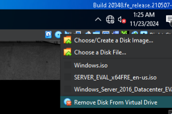

We can go back to our Windows Server 2022, open File Explorer, and see that the Z: drive for SimoTech Lab is available. Once we open it, we will find the PDQ Deploy applications. We can then drag the application onto the desktop and begin the installation.
if you dont see the file, net use Z: "\\VBOXSVR\SimoTech Lab" in cmd

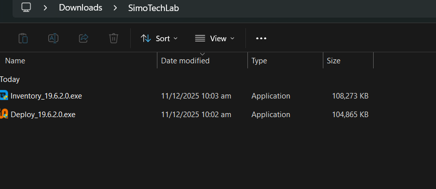

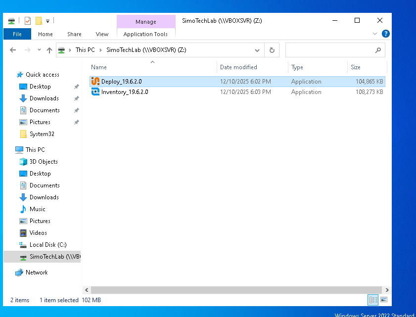

Select “Next” → accept the terms → “Next” then install.

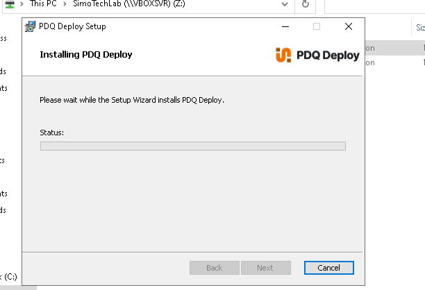

Once the installation is finished, we can launch the application. Next we sign into our Administrator credentials.

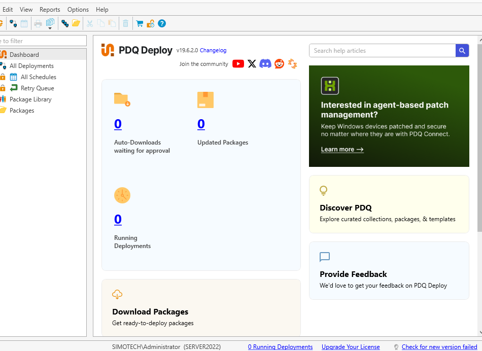

Now that PDQ Deploy is ready, let's re-enable our internet connection. To do this, we need to go to Devices → Network → Network Settings, and change the setting to NAT. Then, open Control Panel → View Network Status and Tasks, and click on Change Adapter Settings. Right-click on Ethernet and select Properties. Next, double-click on Internet Protocol Version 4, and set it to Obtain an IP address automatically.

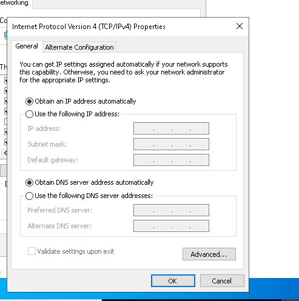

Our internet should now be active. To verify, we can open Command Prompt and ping google.com. Additionally, the internet icon on the bottom right of the screen should be available, indicating a successful connection.

Now, let's go back to PDQ Deploy and select "Extend" to activate the inactive subscription.

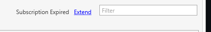

Extending the subscription will grant us a free trial of the Enterprise version, which allows access to all the available packages. We will need to enter our information and provide an email address. Once that's completed, we can start deploying packages using PDQ Deploy. Let's proceed by deploying Mozilla Firefox.
use temp mail to login if wala ka business email.

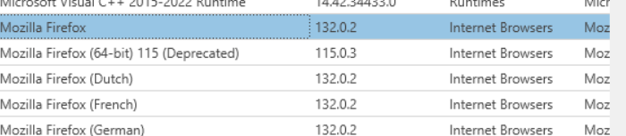

Double-click on the Mozilla Firefox package, and it will automatically start downloading. Once completed, it will appear in the Packages section.

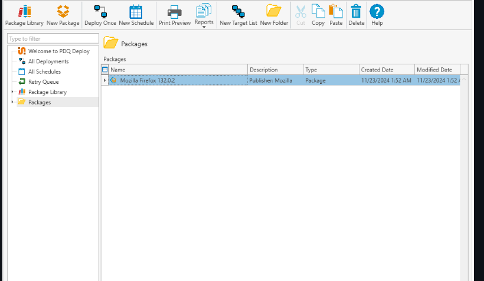

Right click on Mozilla Firefox and select “Deploy once”

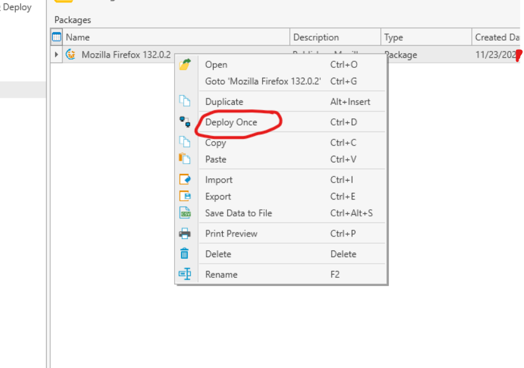

Then select “Choose targets” → “Active Directory” → “Computers”
Then select “Server2022” as our target then select “OK”.
Select “Deploy Now”.

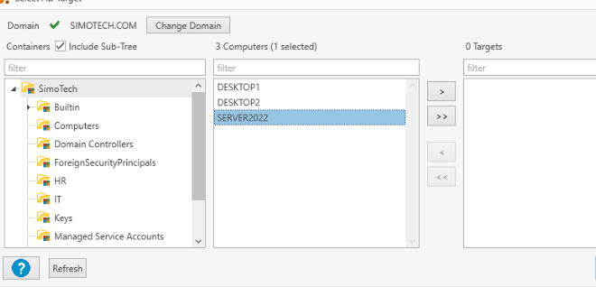

We have officially deploy Mozilla Firefox, the deploy worked perfectly and we can see that Firefox is installed onto our desktop.

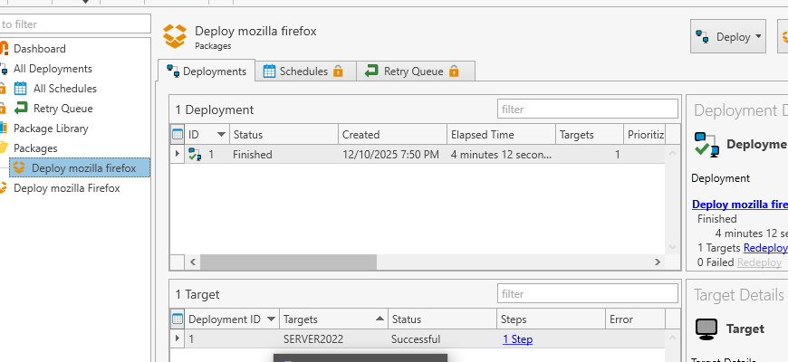

Let's switch back to a static IP. Open Control Panel and navigate to View Network Status and Tasks → Change Adapter Settings. Right-click on the network connection (Ethernet) and select Properties to begin configuring the network settings.

Enter the previously configured static IP settings:

IP Address: 12.1.10.4
Subnet Mask: 255.0.0.0
Default Gateway: 12.1.10.1
Preferred DNS Server: 12.1.10.2
Alternate DNS Server: 12.1.10.1
Click OK to apply the settings.

---

👉 Next Lab 11 : PDQ Inventory: Hardware and Software Reporting

