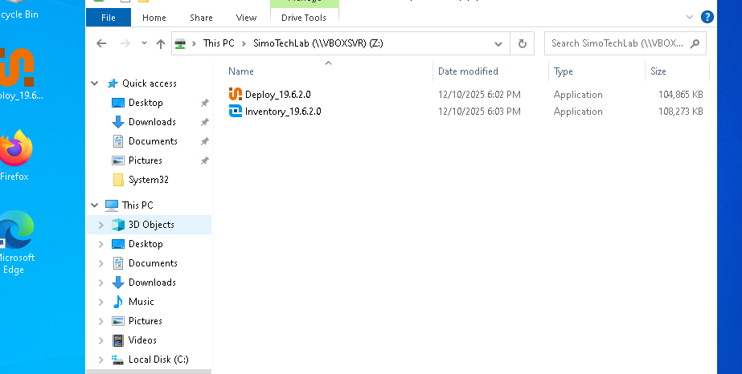
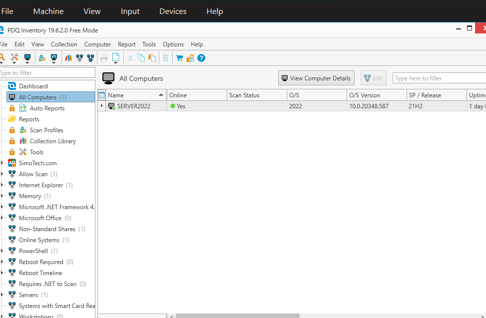
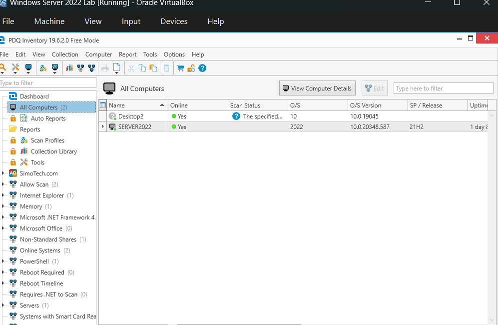
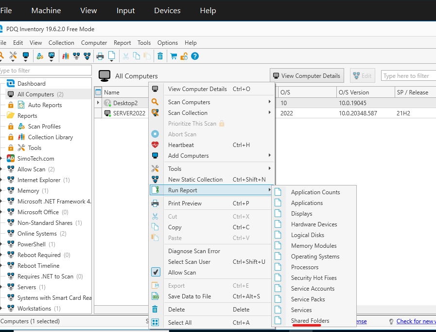
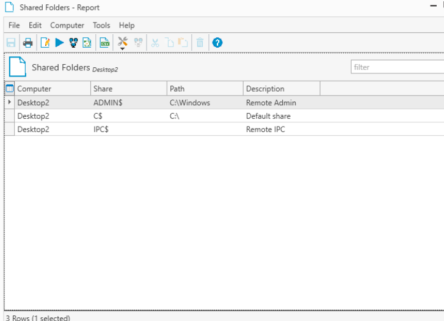

# Lab 11 – Lab 11 PDQ Inventory: Hardware and Software Reporting

## Overview
This repository documents my home lab focused on PDQ Inventory: Hardware and Software Reporting using VirtualBox. The lab aims to explore PDQ Inventory's capabilities for gathering detailed reports on hardware and software configurations across a network of virtual machines. The project will include setting up PDQ Inventory, creating custom reports, and automating hardware/software data collection for system management and network monitoring.

## Objectives
Learn PDQ Inventory: Explore how to set up PDQ Inventory and configure it for comprehensive hardware and software reporting.
Create Custom Reports: Learn how to build and customize reports to track hardware specifications, software installations, and system configurations.

---

## Documentation
In this home lab, I will showcase the installation and uses of PDQ Inventory. To start, open File Explorer and navigate to the SimoTech folder. Inside, you should find the PDQ Inventory application.

We can double click on the application to start the installation then continue it to install to finish. Launch the application once finish.

Lets add Desktop2 to PDQ Inventory, to do that select “Computers” on top → “Add computers” then “Active Directory - Browse by Name” then select “Desktop2.SimoTech.com” as the target to add then select “OK”.

PDQ Inventory is a powerful IT asset management tool that helps track and manage hardware and software across a network. It provides real-time insights, automates reporting, and integrates seamlessly with tools like PDQ Deploy for efficient software updates and policy compliance.

Here are some of the features we can use in PDQ Inventory: Right-click on Desktop2, then select Run Report → Share Folders to generate a report on the shared folders available on that machine.

This show us all the folders that are mapped on it. Lets double click on “ADMIN$”

