# Lab 13 –  Lab 13 Understanding Tickets Using Spiceworks

## Overview
This repository documents my home lab focused on Understanding Tickets Using Spiceworks within a VirtualBox environment. The lab aims to explore how Spiceworks can be used to manage IT tickets, track service requests, and streamline support workflows.

## Objectives
Learn Spiceworks Ticketing System: Set up and configure Spiceworks to create, manage, and track IT support tickets.
Ticket Management: Understand how to categorize, prioritize, and assign tickets to team members within a virtualized network environment.
Reporting and Analysis: Learn how to generate reports on ticket resolution times, trends, and overall support performance.

---

## Documentation
In this lab, we will focus on Spiceworks ticketing services, which is free to use, and explore how Remote Support can assist users.

To begin, we will create an account for Spiceworks using an email. After the account creation, we will set up a domain, which will be the same domain we've been using in our previous labs, SimoTech.com. Once the account and domain are ready, we will launch the IT Cloud Helpdesk through the IT tools tab at the top of the Spiceworks interface.

From there, we will dive into the ticketing system to understand how it works and how we can use it for managing IT support requests.

Here on the Spiceworks dashboard, we have a centralized interface for IT professionals. It provides a clear overview of key metrics, including new, open, and unassigned tickets. Additionally, it displays network inventory, device health, and alerts, giving us a comprehensive snapshot of the IT environment and ongoing support activities.

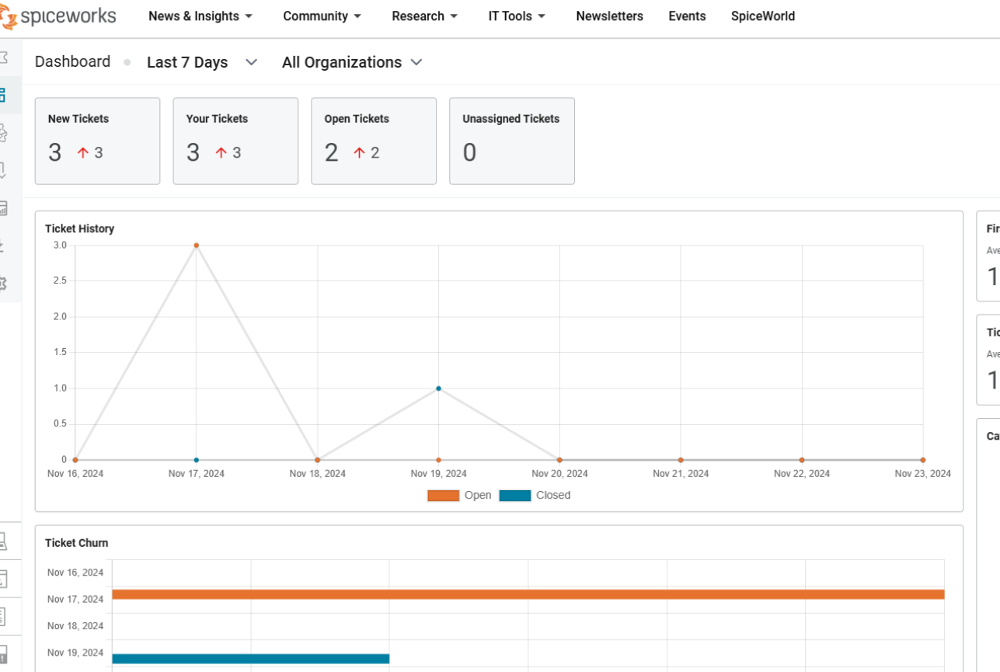

Let's take a look at creating a ticket and the properties involved in the process. Start by selecting the Ticket tab on the left-side panel, then click on the blue "New Ticket" button at the top right.

Let's break down each of the properties of a ticket:

Organization: This refers to the domain or company that the helpdesk is working for, ensuring that tickets are associated with the correct organization.

Contact: This is the person who is reporting the issue. It could be an employee, user, or external contact who is reaching out for assistance.

Assignee: The person or group assigned to fix the issue. This is typically an IT support member or a specific team who will handle the resolution.

Summary: A brief description of the issue, explaining the situation at hand. This provides a quick overview of the ticket for anyone reviewing it.

Priority: This indicates the urgency of the issue. Depending on the situation, priority can range from low to high, helping to set expectations on when the issue will be addressed.

Category: This classifies the ticket into a specific group, such as Email, Hardware, Network, Software, or other types. It helps to organize tickets by their nature and directs them to the right team for resolution.

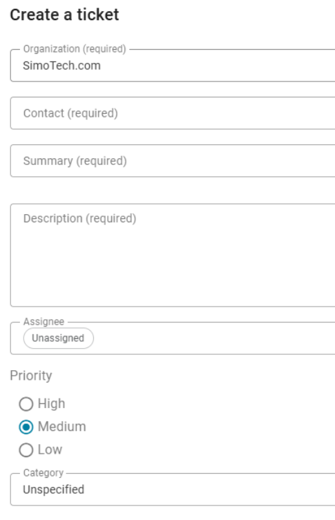

Let's simulate a helpdesk environment using Spiceworks' ticketing system. Our objective is to demonstrate efficient ticket management by creating, assigning, prioritizing, and resolving tickets, while properly documenting each step of the process.

To get started, we need to add a helpdesk technician who will be responsible for handling the tickets. Follow these steps:

Go to the Settings panel on the left side.
Select Employee Administration.
Click on Add Employee.
Assign the role of Tech to the new helpdesk technician to ensure they have limited access to tickets and settings.

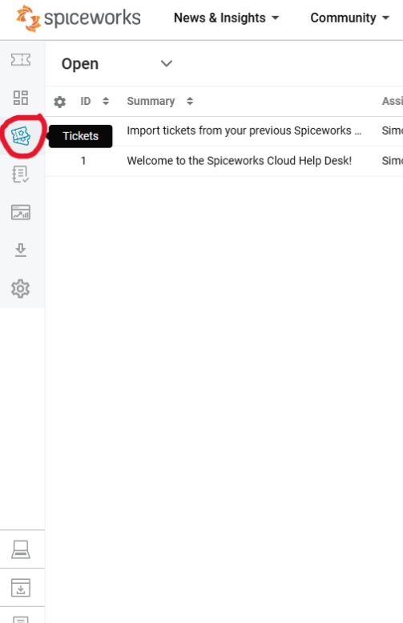

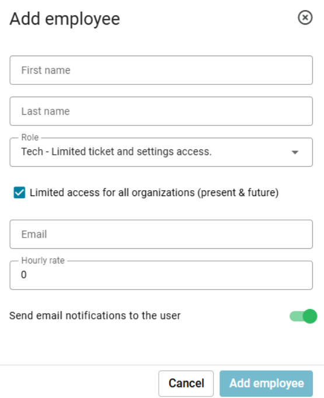

We will need to use a real email but creating email should be easy. Once we create an employee we then select “Add employee”.

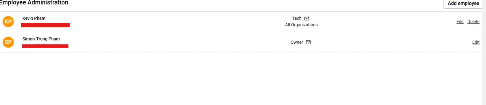

Next, let's create a sample issue. In this scenario, a user named Bob is experiencing difficulty logging into his computer, Desktop2, because his account is locked out. To report the issue, Bob will send an email to our Helpdesk.

Bob should use the following email address to submit his request: help@simotech.on.spiceworks.com. This email address can be found under the General tab, associated with the domain SimoTech.com.

Once we receive Bob’s email, we'll create a new ticket in the system to document and address his problem.

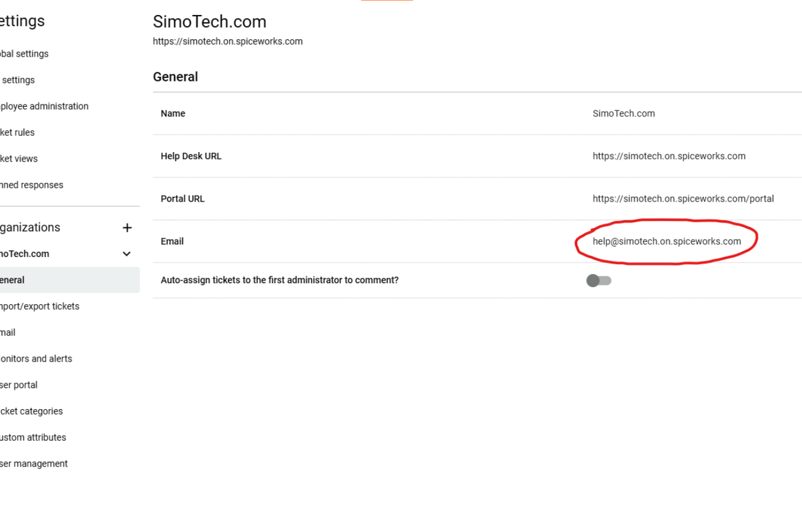

In this step, I'll act as Bob and send an email to the domain's Helpdesk to report the issue. The email will be directed to the Helpdesk address, and we should now receive it in our Spiceworks ticketing system. Once the email arrives, it will automatically generate a new ticket that we can manage and resolve.

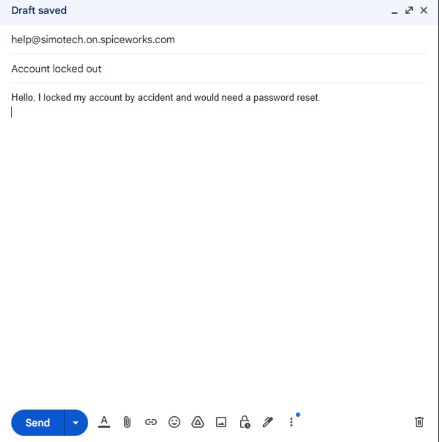

Now that our ticket has been issue, we can accept the ticket and assignee to our helpdesk tech “Kevin”.

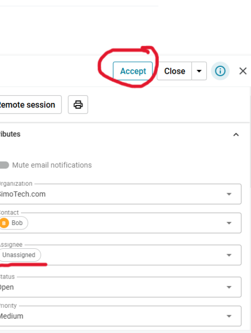

Once we receive the email, we'll click Accept to start working on the ticket. Next, we'll assign the ticket to our Helpdesk technician, Kevin. We'll set the Priority to High since the user cannot log in and is unable to perform any work. Additionally, we'll set a Due Date for the following day to ensure prompt resolution. For the Category, we'll leave it as "Other."

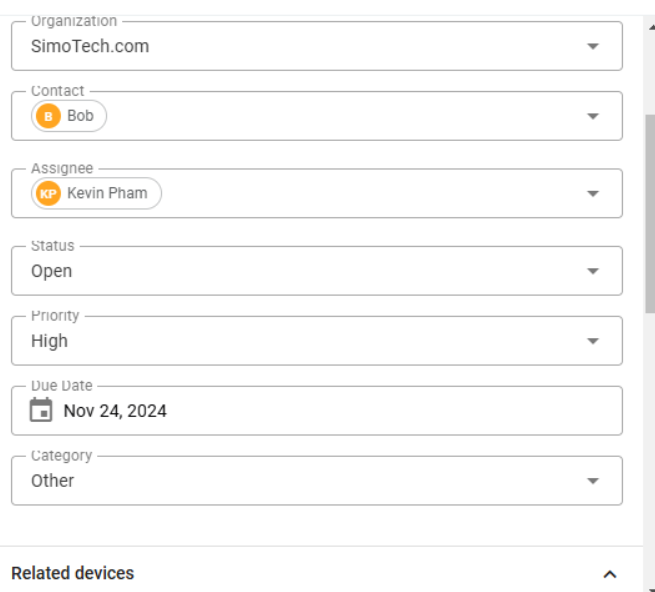

We can also set up tasks to guide our Helpdesk technician. I've implemented three tasks for Kevin to assist him with the account lockout ticket. Additionally, we can track the time spent working on this issue by selecting the “+15m” option.

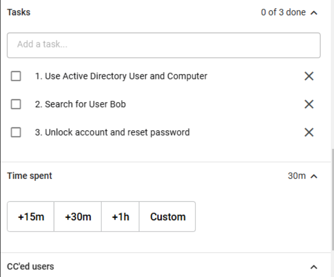

Our helpdesk will contact Bob with issue being fix after everything is sorted then we can finally close the ticket.

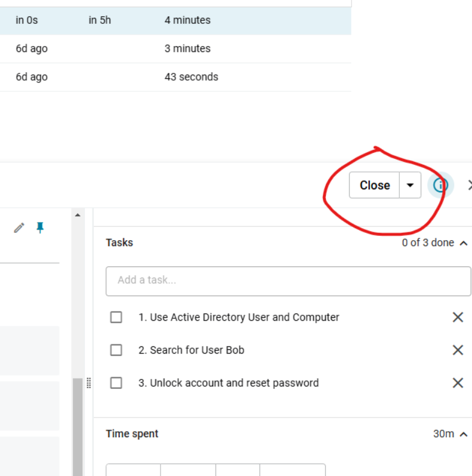

We can check our past tickets by selecting the drop down on “Open” to “Closed”.

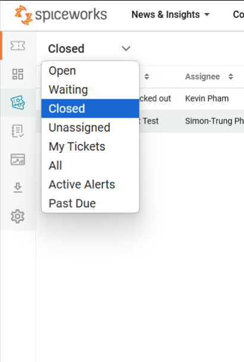

Spiceworks offers a unique feature that enables remote support for users in need of assistance. To access this feature, go to Tools and then select Remote Support.

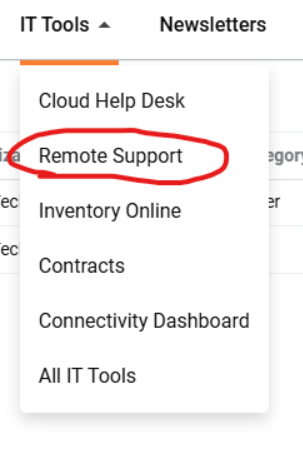

Next, select Start Remote Session, and a code will be generated. This code should be provided to the user so they can join the remote session.

Now, let's log into Bob’s account on Desktop2 VM to join the remote session. First, we need to connect to the internet since we're on a static IP. Follow these steps:

Go to Devices → Network → Network Settings → then select NAT.

Open the Control Panel → choose View Network Status and Tasks → then Change Adapter Settings.

Right-click on Ethernet → select Properties.

Double-click on Internet Protocol Version 4 (TCP/IPv4), then change the setting to Obtain an IP address automatically.

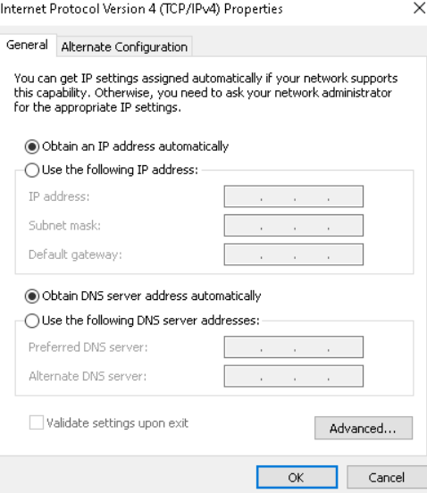

Next, let's open Firefox, which we've already installed using PDQ Deploy. In the browser, navigate to https://join.zoho.com/587255844 and enter the session ID. Click on Agree and Download, then run the ZA_Connect.exe file to join the remote session.

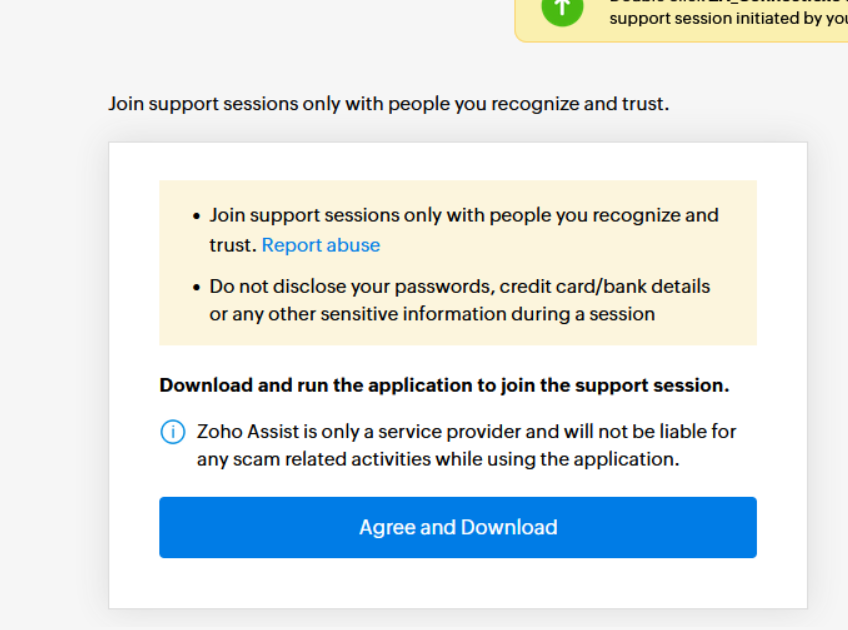

Now, back in our Spiceworks browser, we have full remote access to Desktop2 VM on Bob’s account.

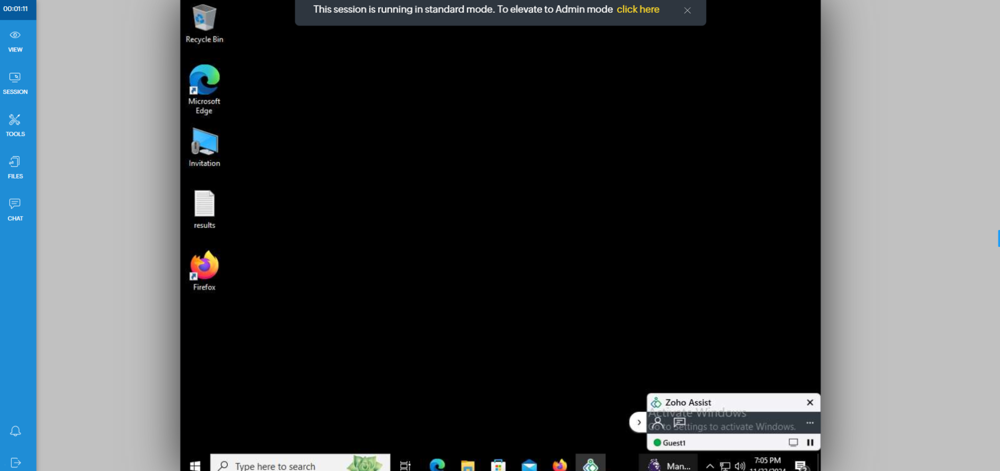

With Remote Support, there are many tools at our disposal. One useful feature is the Chat option on the left side of the panel, which allows us to communicate directly with the user. The chat box will open on the right side of the screen.

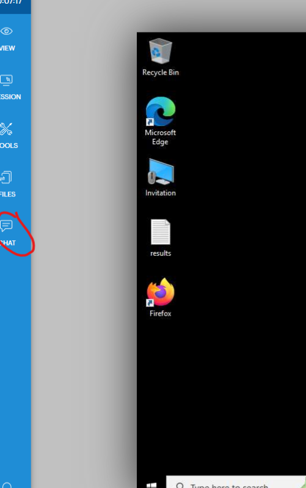

On our Desktop2 VM, we can see that the Chat feature is available for the user to communicate with the Helpdesk.

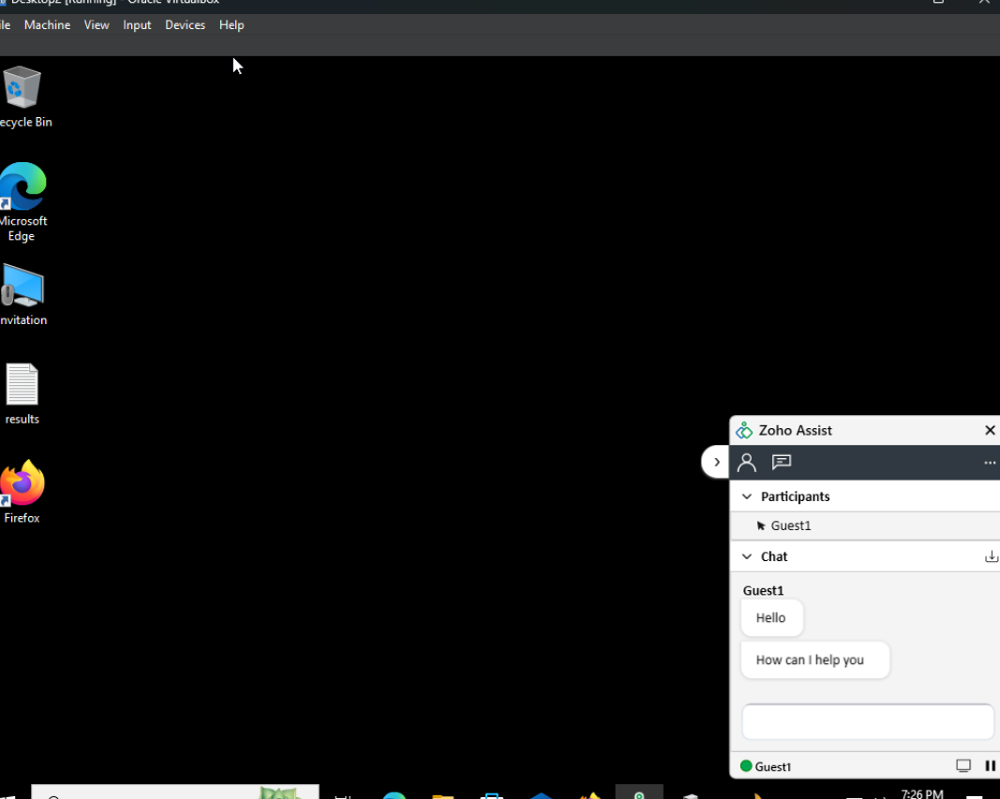

For tools, we can launch different commands such as opening up command prompt.

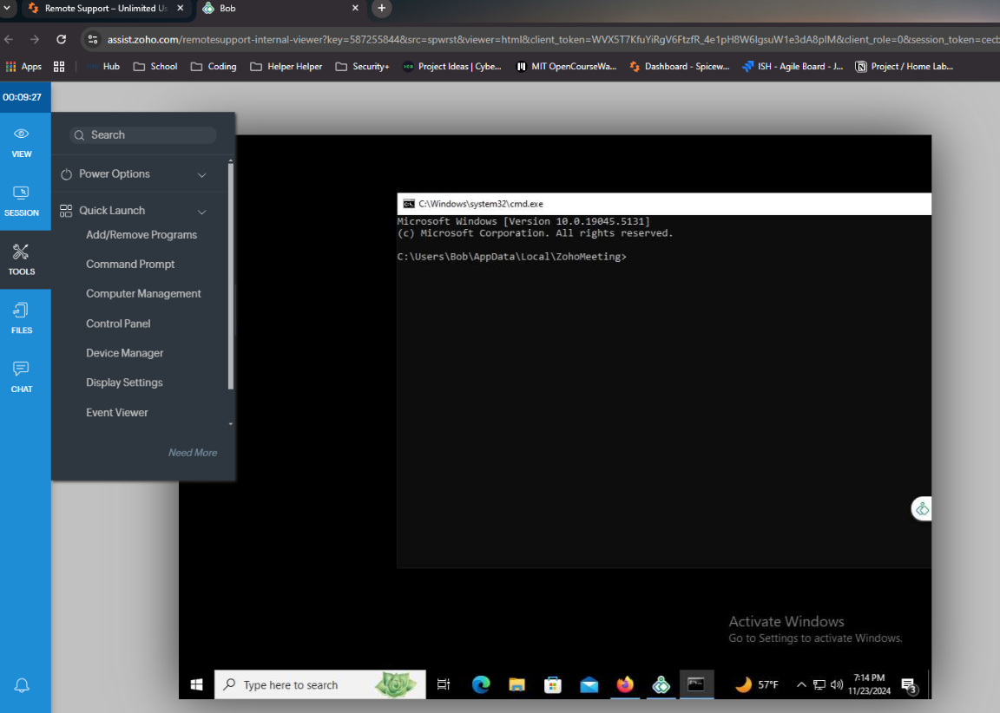

We can also open up Device Manager.

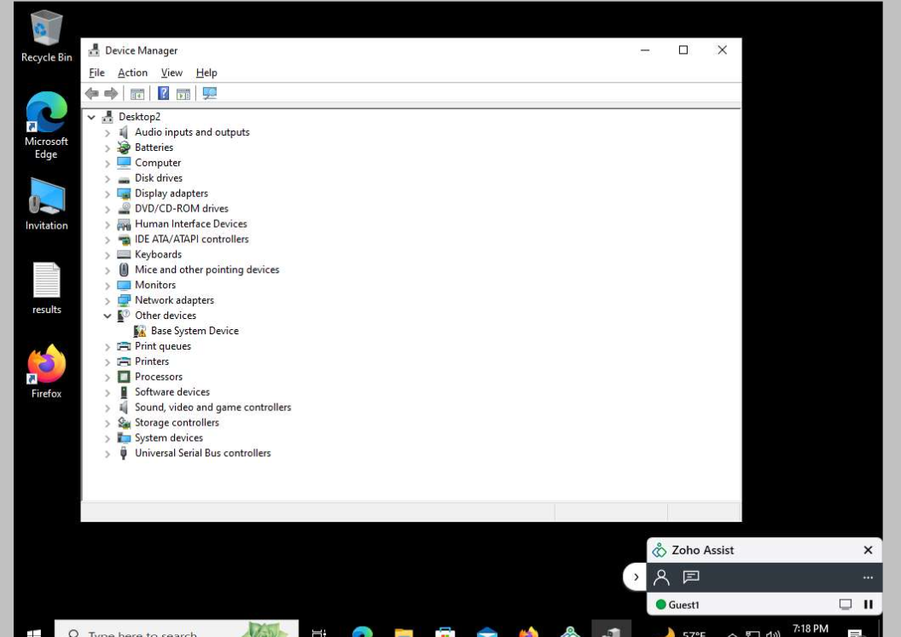

To elevate to Admin Mode, use your Administrator credentials. First, select the session on the left side panel, then click on Elevate to Admin Mode. For the user, enter Administrator@SimoTech.com and provide the password.

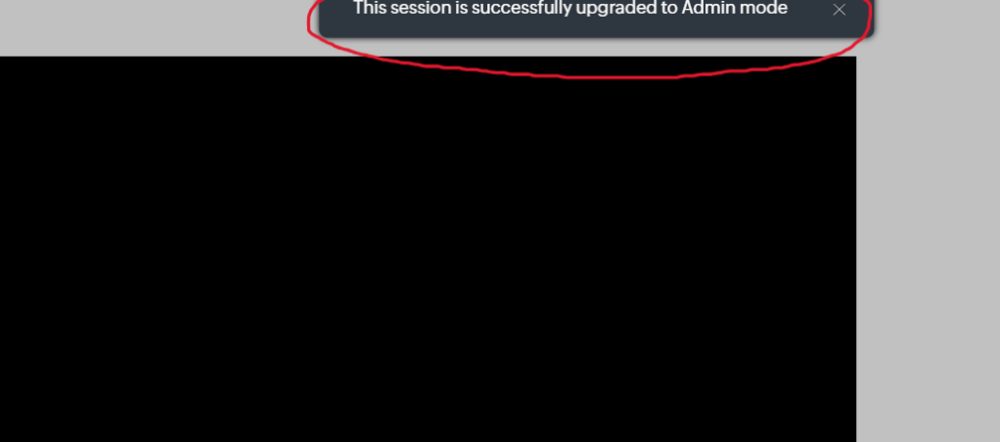

With Admin Mode enabled, we can now use the session tool Send Alt+Ctrl+Del.

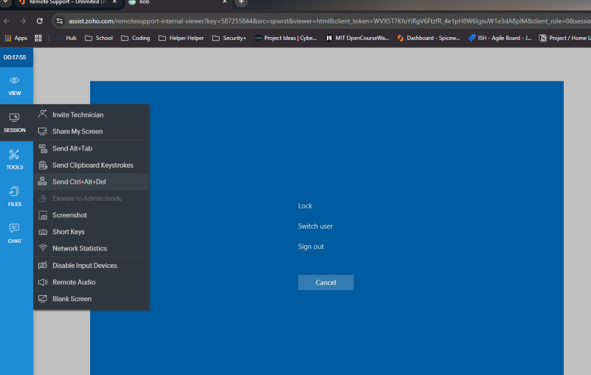

---

These are just a few of the many features Spiceworks Remote Support offers to assist Helpdesk teams in providing support to users. Now, we can exit the remote session on our Desktop2 VM and switch the network back to the static IP.

With that, we've successfully completed this home lab, gaining a solid understanding of how the Spiceworks Ticketing System and Remote Support Tool work.

👉 Next Lab 14 : Delegate Control and Account Lockout Management

