# Lab 14 —  Lab 14 Delegate Control and Account Lockout Management

## Objectives
Delegate Control: Implementing and testing delegation of administrative privileges in an AD environment to different users or groups, ensuring least privilege access.
Account Lockout Management: Configuring and testing account lockout policies to secure accounts from brute-force attacks while ensuring proper exception handling.

---

## Documentation
In this home lab, we will focus on understanding Delegation Control and Account Lockout. Delegation involves granting a user limited access through Active Directory. To begin, we will create a new user in Active Directory Users and Computers on our Windows Server 2022 VM.

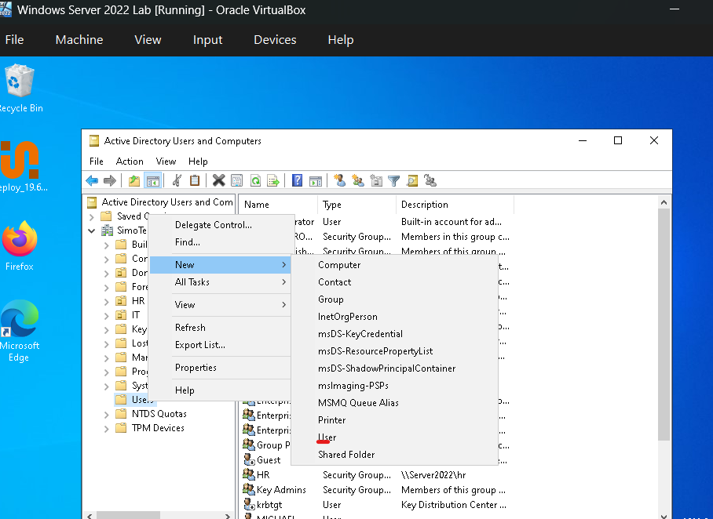

We will create a user named Andrew for both the First and Last Name, and his login username will also be Andrew.

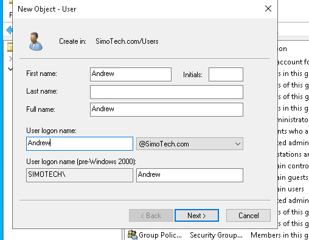

After creating the user Andrew, we will create a new Organizational Unit (OU). Right-click on the domain SimoTech.com, select New → Organizational Unit, and name it Consultants. Then, drag Andrew into the newly created Consultants OU and click Yes to confirm.

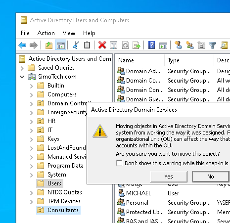

Next right click on the domain SimoTech.com and select “Delegate Control”

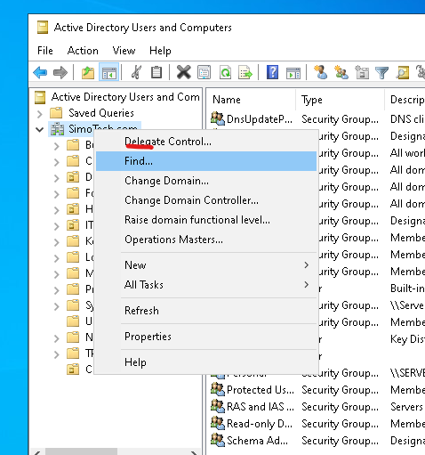

Then add “Andrew”.

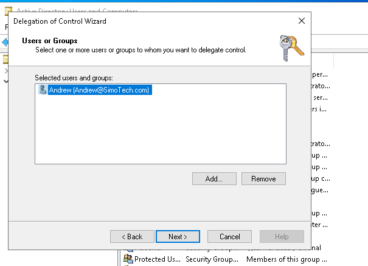

Will only give Andrew the permission to reset passwords for other users. Check mark “Reset user passwords and force password change at next logon”. Then select “Next” then “Finish”.

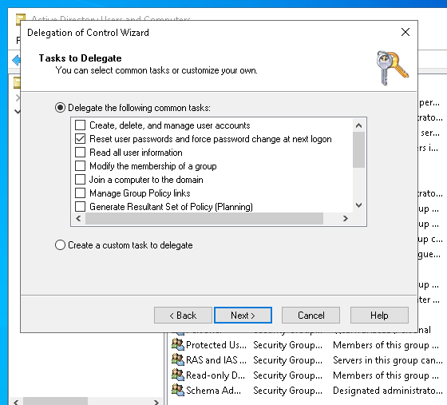

Now that the setup is complete, let's log in as Andrew on our Windows 10 VM. Open Active Directory Users and Computers. To verify the actions available to Andrew, search for the user Bob, right-click on his account, and select Properties. Then, go to the Account tab. Under Account options, you'll notice that everything is grayed out except for the option User must change password at next logon.

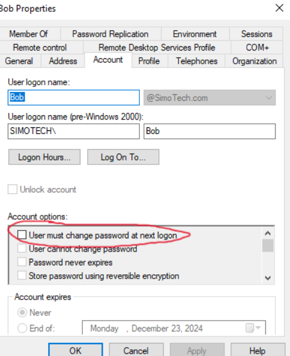

To verify further, let's right-click on Bob and select Reset Password. This will prompt us to reset Bob's password.

Next, let's lock out Andrew's account. Use the Input button at the top of the VM, select Keyboard → Insert Alt + Ctrl + Del, then choose Lock. This will intentionally lock Andrew's account.

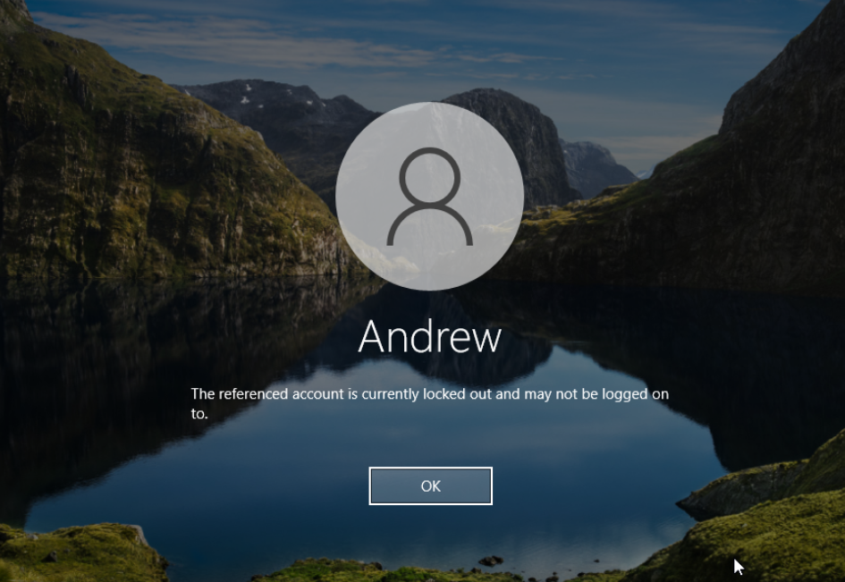

To investigate a user account that has been locked out, we can use a tool from Microsoft called the Account Lockout and Management Tools. We can download it from Microsoft’s website at this link. After downloading, we’ll move the file into our SimoTech Lab folder, which is shared with our Windows Server 2022 VM.

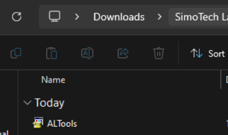

Next, we need to enable shared folders on our Windows Server 2022 VM. Right-click on the folder icon at the bottom and select Share Folder Settings. For the Folder Path, locate the SimoTech Lab folder in our Downloads directory. Check the box for Auto-mount and click OK.

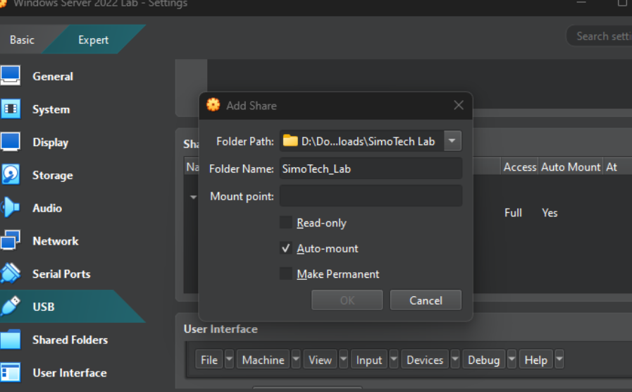

The SimoTech Lab folder should now appear as our Z: drive. Open the Z: drive, then locate and open the Account Lockout and Management Tools application. Run the tool to begin the investigation.

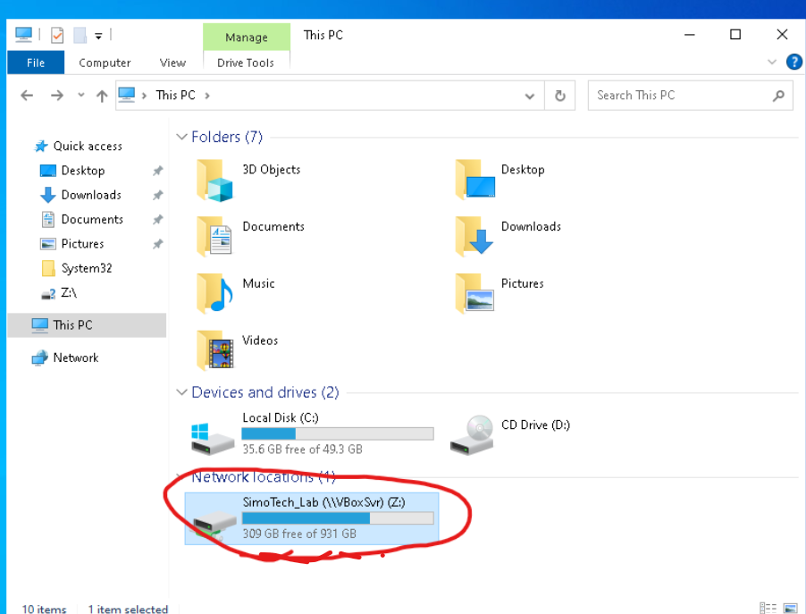

For extraction location, choose the Documents and select “OK”.

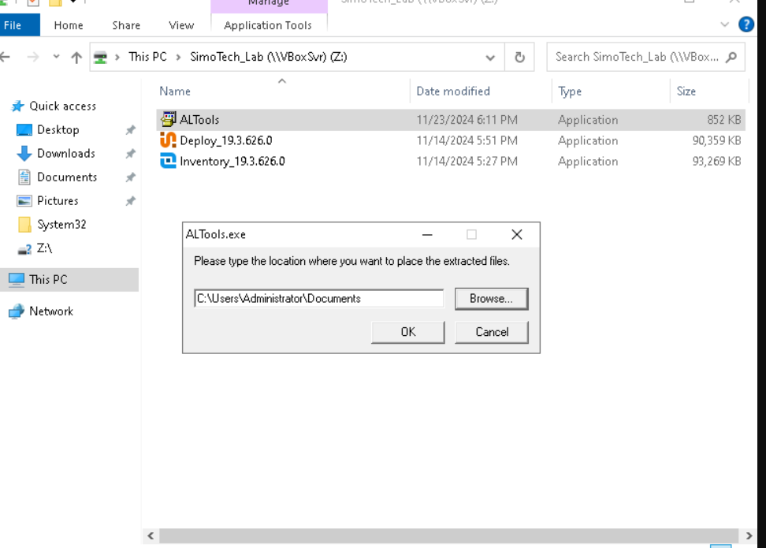

In Documents, open the LockoutStatus application. This tool is designed to analyze and manage account lockouts in Active Directory environments. It's especially useful in large or complex networks where account lockouts may be caused by issues such as misconfigured applications, password synchronization problems, or unauthorized access attempts.

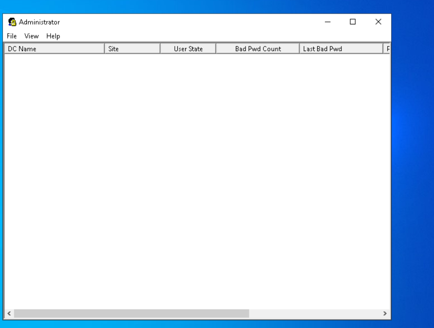

Navigate to File in the top-left corner and select Select Target. Enter Andrew as the target user and click OK. This will display the User State, which shows that the account is currently locked due to 4 bad password attempts. It also provides key details, including the time of the last password attempt, the date the password was last set, the domain or origin of the lockout, and the lockout timestamp.

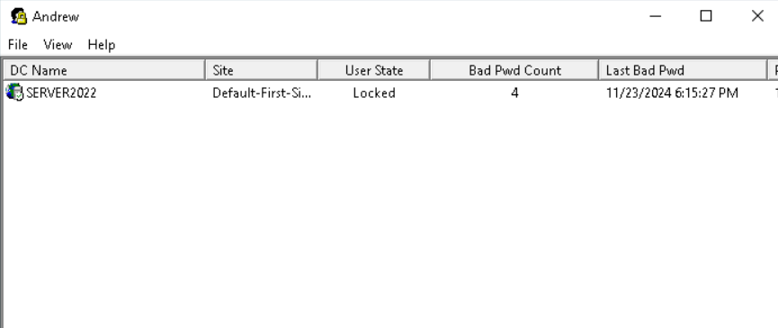

Now that we’ve confirmed Andrew’s account is locked, we can fix it by following these steps:

Open Active Directory Users and Computers.

Search for Andrew in the Consultants organizational unit (OU).

Right-click on Andrew and select Properties.

Go to the Account tab and check the box for Unlock account.

Click Apply to unlock the account.

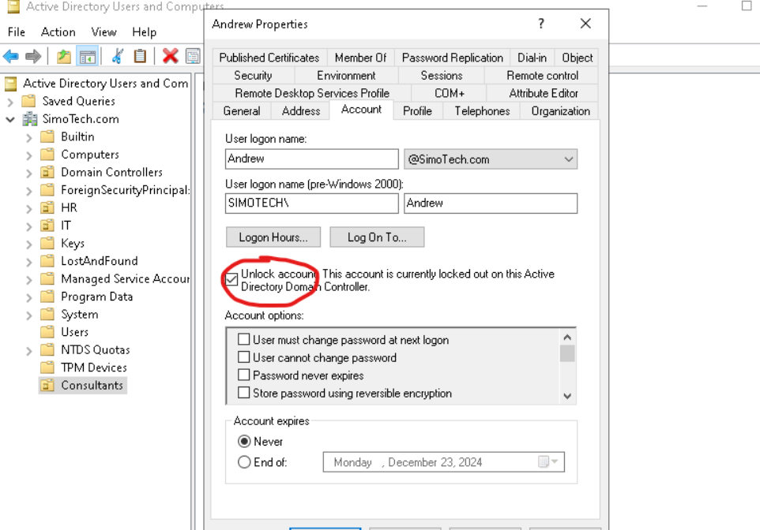

Now we can have Andrew sign back into his account.

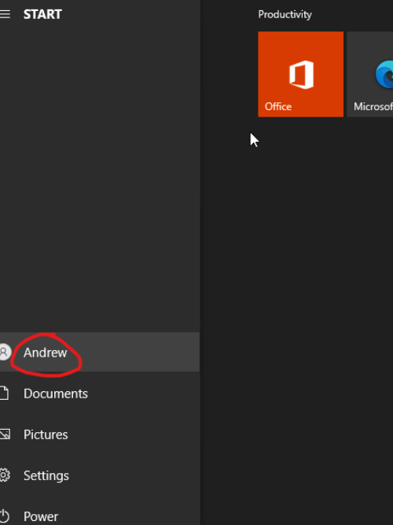

If we run the Bobby application again and search for Andrew, the results will show that the account is no longer locked.

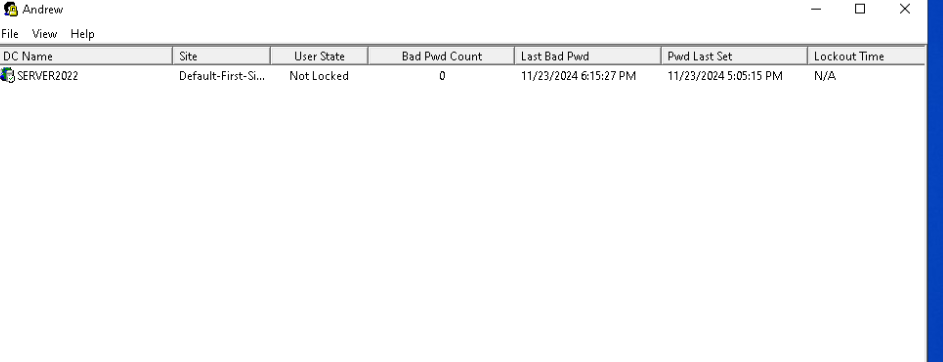

---

Congratulations! We have successfully completed the final home lab, gaining a thorough understanding of Delegation Control and how to investigate an account lockout using Microsoft’s Account Lockout and Management Tools.

