# Lab 2 — Renaming Windows Server 2022 and Installing Active Directory

## Overview
In this lab, we will rename our Windows Server 2022 machine and install **Active Directory Domain Services (AD DS)**.  
This prepares the server to function as a domain controller in our home lab environment.

---

Rename the Server

Now that we have Windows Server 2022 set up, we can proceed with installing Active Directory on our virtual machine home lab. 
Before that, let's rename our computer to keep things simple. To do so, open File Explorer from the taskbar, right-click on "This PC," and select "Properties."

**Screenshot:**  

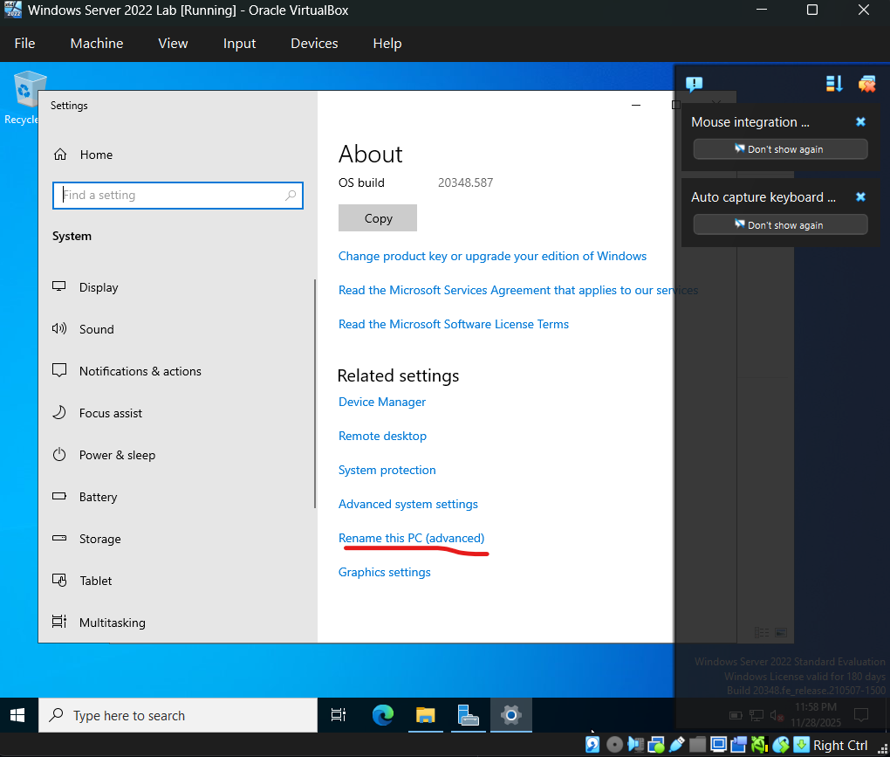

---

Click **Change**.
We will rename the computer to "Server2022" and then click "OK." A prompt will appear asking you to restart your virtual machine, which is normal. Click "OK," then select "Restart Now" to apply the changes.

**Screenshot:**  
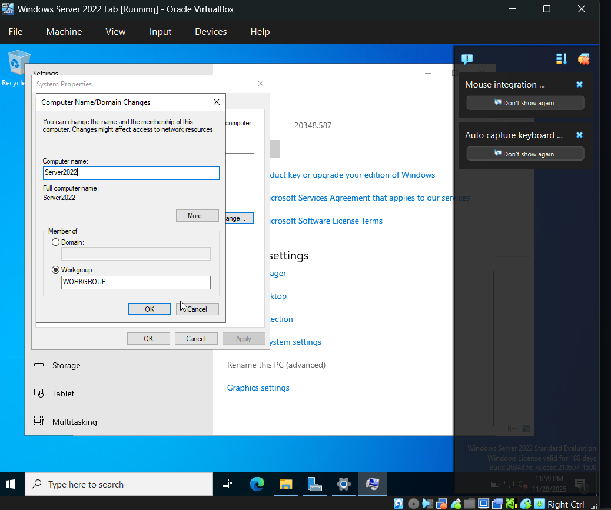

---

If this show to your ide do this.
FIX: Re-attach ISO + Boot Installer
1. Go to Settings → Storage

Under Controller: IDE / SATA, select Empty

2. On the right side, click the CD icon

Choose:

✔ Choose a disk file…
Then select your Windows Server 2022 ISO.

⚠ After attaching ISO:
3. Go to Settings → System → Boot Order

Make sure:

Optical (ISO) – CHECKED

Hard Disk – CHECKED

Network – UNCHECK!!!

Order example:

✔ Optical
✔ Hard Disk
✘ Network

4. Start your VM.

Dapat mag-boot ulit sa Windows Server installer.

**Screenshot:**  
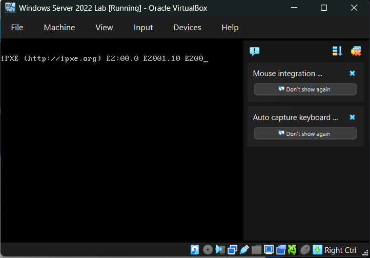

---

To optimize our performance for running virtual labs more efficiently, let's go to the search bar at the bottom left, type "About your PC," and select "Advanced system settings." In the "System Properties" window, click on the "Settings..." button under the "Performance" section. In the "Performance Options" window, select "Adjust for best performance," then click "OK" to apply the changes.

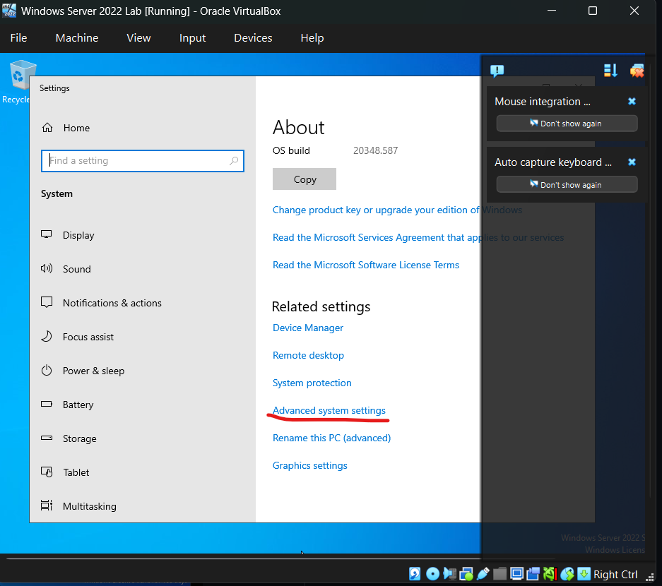
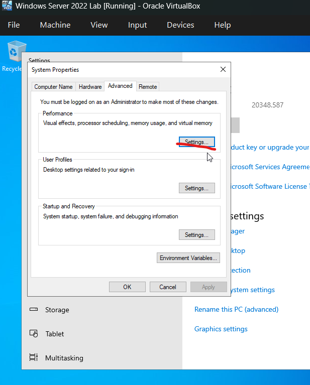
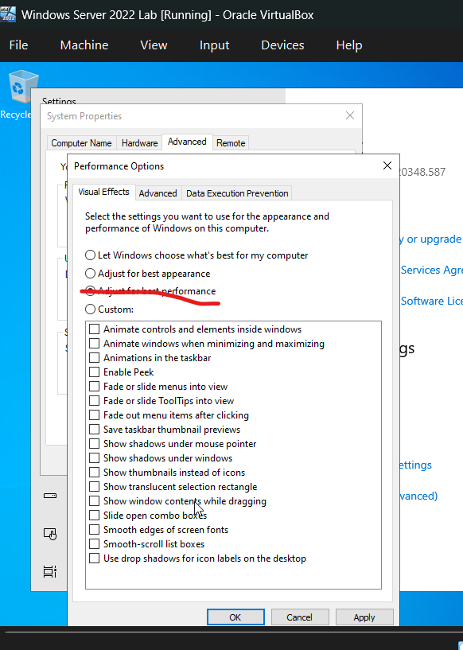

---

Next, we will install Active Directory on our Server2022. Open Server Manager, click on "Manage" in the top right corner, then select "Add Roles and Features." Click "Next," then choose "Role-based or feature-based installation" and click "Next" again to proceed.

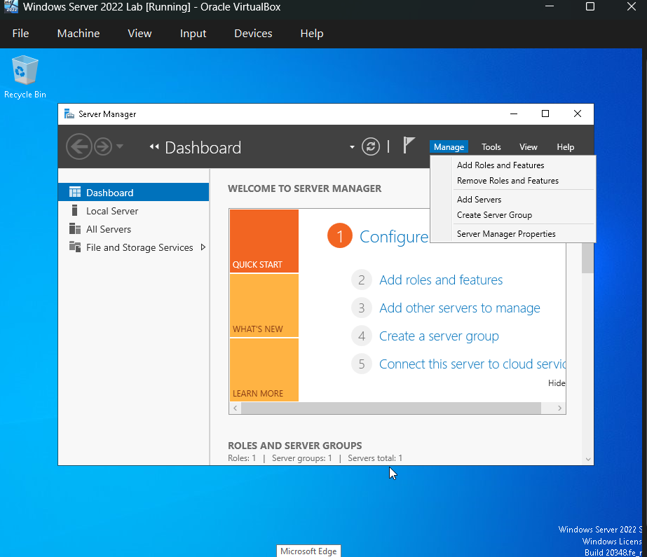
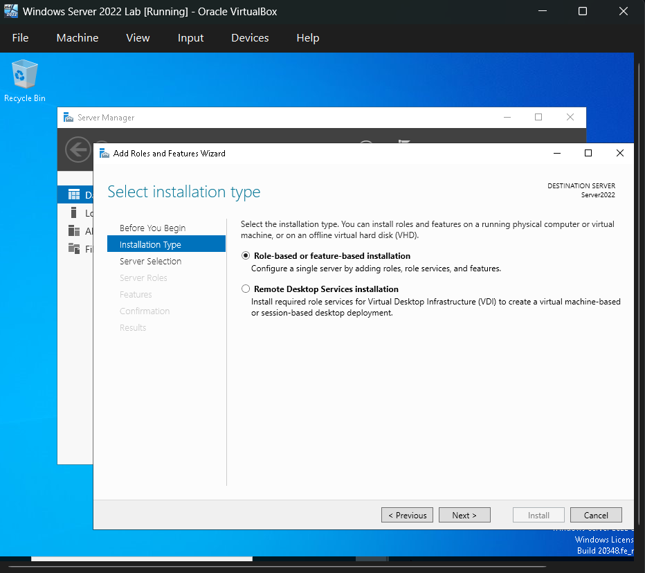
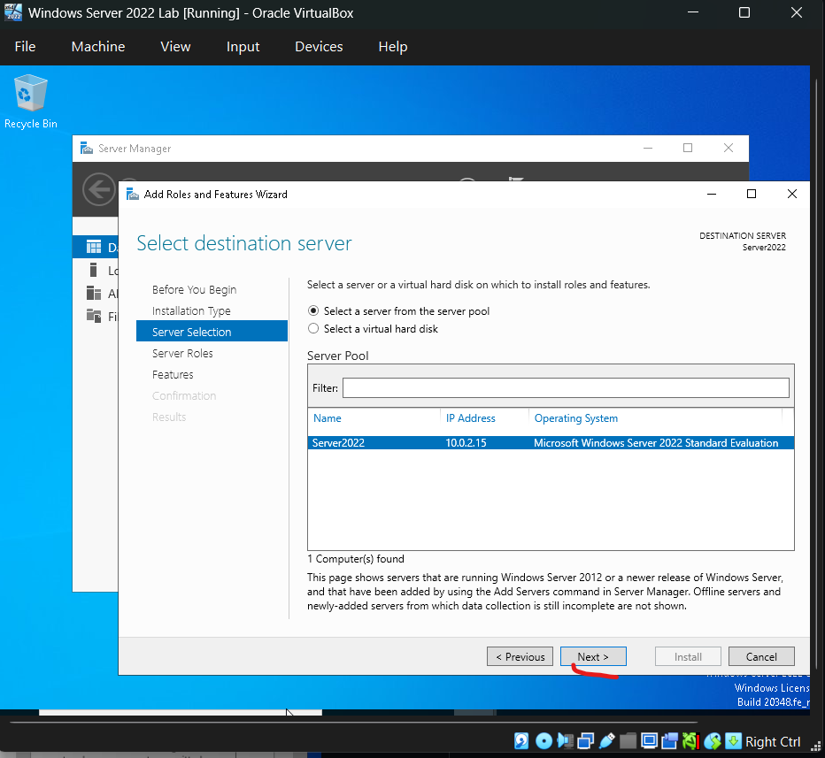

Select "Active Directory Domain Services," then click "Add Features" when prompted. After that, click "Next" to continue.
and install

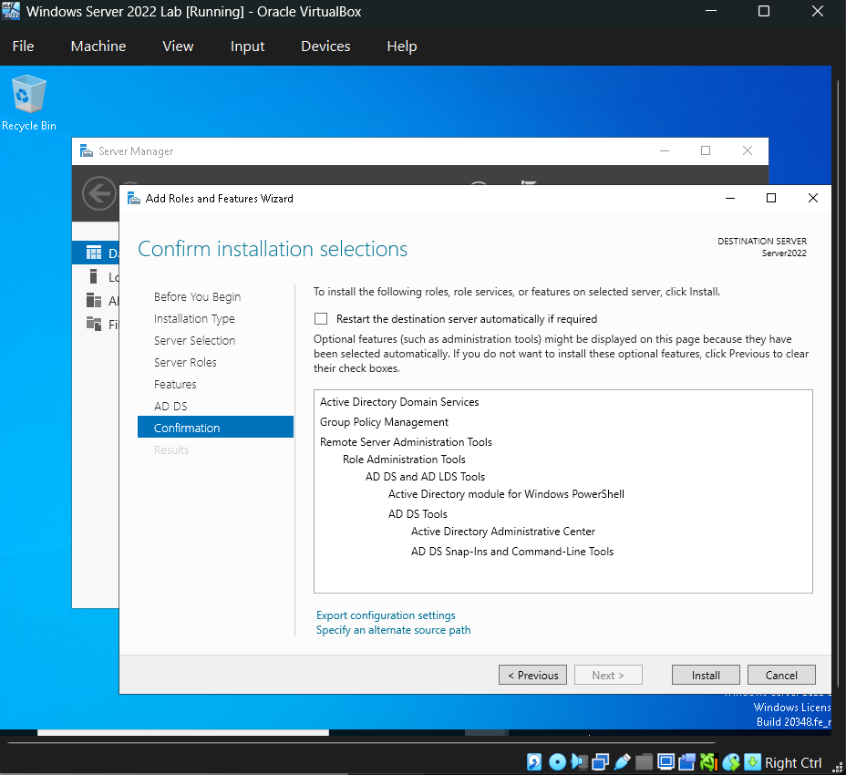

Select “Promote this server to a domain controller”.

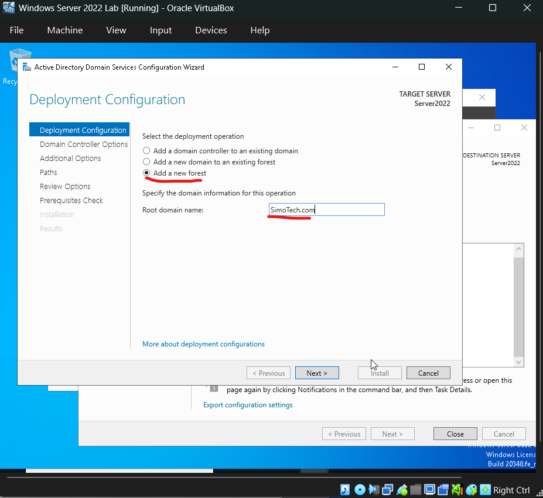

Create a password for our Directory Service Restore Mode (DSRM) then click “Next”.

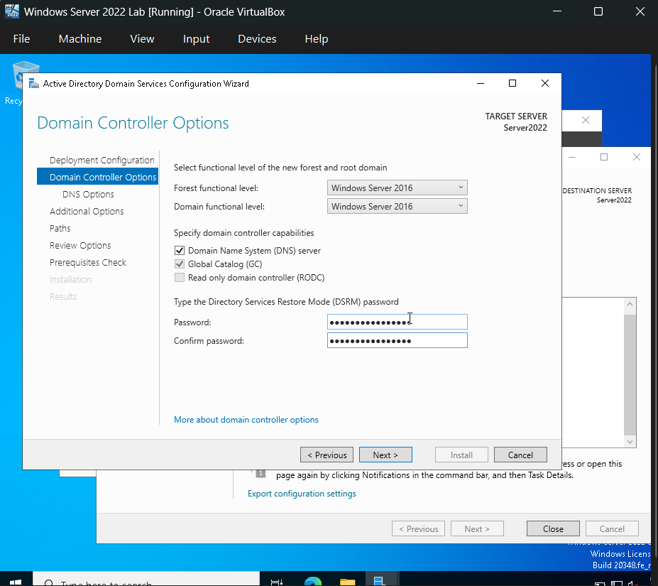

We can uncheck “Create DNS delegation” then click “Next” then “Install”.

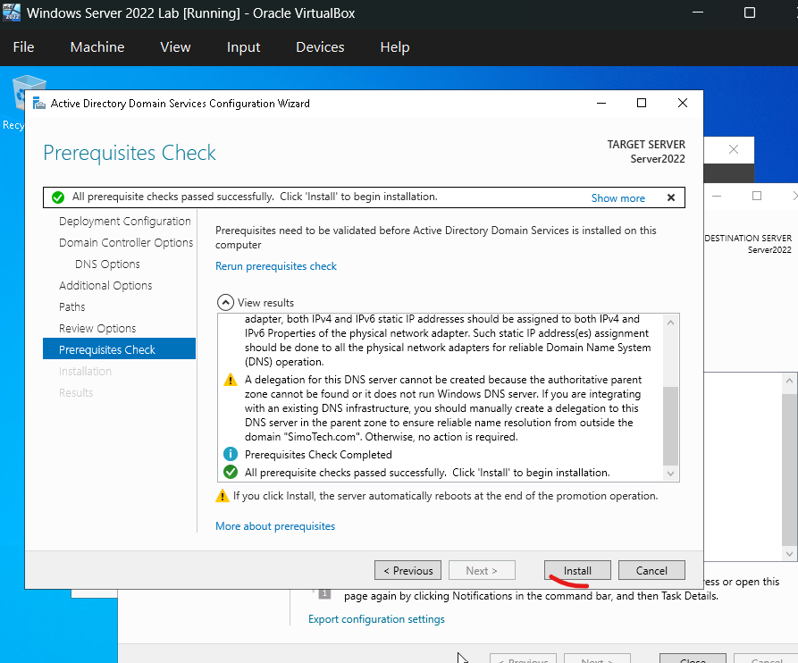

