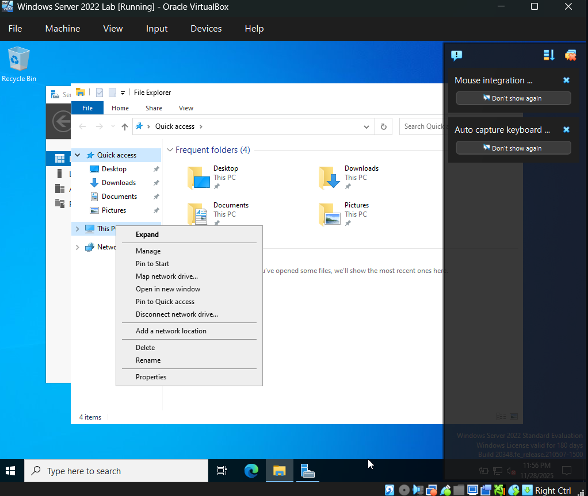

# Lab 3 — Creating Help Desk Accounts in Active Directory & Using CMD Commands

## Overview
In this lab, I demonstrate how to create a dedicated **Help Desk account** inside **Active Directory** and verify it using essential **CMD (Command Prompt)** commands.  
This simulates real-world IT Helpdesk responsibilities such as provisioning accounts, assigning permissions, and checking configurations.

---

## Objectives
- Create a Help Desk account in Active Directory  
- Enable the AD Recycle Bin  
- Assign appropriate permissions  
- Use CMD commands to verify account and network settings  

---

## Step 1 — Enable the Active Directory Recycle Bin
1. Open **Active Directory Administrative Center**.  
2. Click **SimoTech.com (local)**.  
3. Select **Enable Recycle Bin** → click **OK**.  
4. You should now see **Deleted Objects** under the domain.
   **Screenshot:**  

Once you enable the Recycle Bin, the "Enable Recycle Bin" option should be grayed out, and you should now see "Deleted Objects" listed under your local domain in the Active Directory Administrative Center. This confirms that the Recycle Bin feature has been successfully enabled.

With Server Manager open, on the top right, select “Tools” then “Active Directory Users and Computers”. Lets also pin Server Manager and Active Directory Users and Computers to our task bar by right clicking the icons on the bottom and select “Pin to task bar”.

Now, open "Active Directory Users and Computers," click on "View" at the top, and then select "Advanced Features" to enable advanced options in the interface.

In the "SimoTech.com" domain, select "Users," then right-click on the "Administrator" account and choose "Copy." This will replicate the appropriate permissions from the Administrator account to the new Help Desk account, ensuring it has the necessary administrative permissions for tasks.

For the new Help Desk account, use "Helpdesk" as both the first name and last name, and set the same for the User logon name (Helpdesk). This will help maintain consistency and clarity for the account.
Create a password for our helpdesk account. Then select “finish”.

Now we can see that our Helpdesk account is part of the same groups as our Administrator account.

---

## Step 2 — "Command Prompt"
Now, let's focus on important CMD lines for admins and the helpdesk. First, open the Command Prompt by searching for "Command Prompt" in the search bar at the bottom left and selecting it from the results.
For our first command, type ipconfig and press Enter. This command will display details about your computer's network setup, including your IPv4 address, subnet mask, and other network configuration information.

We can also type “ipconfig /all” which will display our computer's entire network configuration. It displays all network adapters, our settings, and additional information not shown by the basic ipconfig command such as the DHCP server, DHCP enabled, Lease Obtained and Lease Expires.

Another useful command is net use. This command is used for managing, connecting, and disconnecting network resources, such as printers, shared disks, and other devices. Although we don’t have any resources mapped yet, it will allow us to view existing connections to shared resources or map shared network resources to a drive letter.

The next command is net user helpdesk /domain. This command provides comprehensive details about the "helpdesk" user account, including group memberships, password restrictions, and login configurations. It’s especially useful when managing domain user accounts on a computer that is part of a domain, allowing you to view attributes and settings related to the designated account.

---

### Congratulations! We have successfully created the Helpdesk account using Active Directory Users and Computers and executed essential command-line tasks that are crucial in a Helpdesk environment. Great work!
 Next Lab 4 : Windows 10, Join PC to Domain (Helpdesk), RSAT Tool, Server Manager
