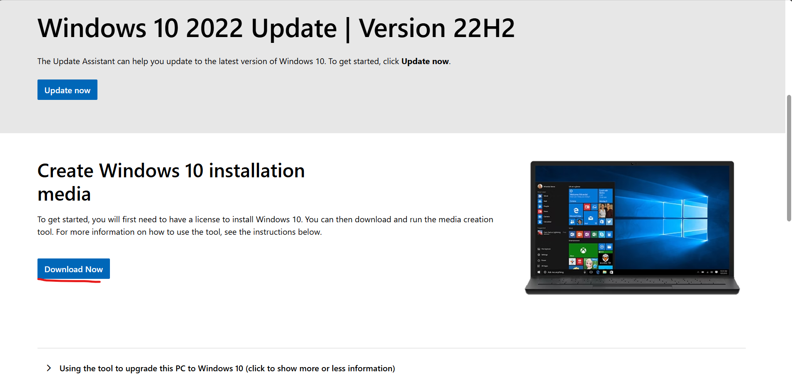

# Lab 5 – Lab 5 Join Windows 10 to Domain (Local User), Group Policy, RSOP Reports

## Overview
In this lab, I created Organizational Units (OUs), users, and groups inside Active Directory on the SimoTech.com domain.  
This simulates real-world IT administration where AD structures help organize users, assign permissions, and prepare for Group Policies.

## Objectives
Join a Windows 10 PC to a domain with a local user account.
Configure and apply Group Policy Objects (GPOs) to enforce settings on domain-joined computers.
Generate RSOP (Resultant Set of Policy) reports to review and troubleshoot applied policies.
Use Group Policy Management Console (GPMC) to manage and configure GPOs.
---

## Documentation
In this home lab, we will create another virtual machine running Windows 10, named Desktop2, to simulate a local user account for testing purposes. This virtual machine will represent an employee in our lab environment. For example, if this user encounters password issues, we can reset it using the Help Desk account on our primary Windows 10 virtual machine.

---

To create the new virtual machine, click on **Machine → New**, then name it **Desktop2**.  
Select the Windows ISO image from your downloads, choose **Skip unattended installation**, and then click **Finish**.  
The process will be the same as we did for our other Windows 10 virtual machine:  
Select **Next → Install now → I don't have a product key**.  
Select **Windows 10 Pro**, then click **Next → Custom: Install Windows only → Next**.

Continue with the same configurations as before for the Windows 10 Helpdesk account. Select Personal Use, then enter User for the name and skip the password creation.

Now that Desktop2 is created, we can create a user for this computer. To do this, open up your Helpdesk PC virtual machine and sign in as Helpdesk. Keep in mind that Windows Server 2022 needs to be running in the background to provide access to Active Directory Users and Computers on our Desktop1 lab machine.

Remember, we currently have three virtual machines running: Windows Server 2022, Windows 10 Helpdesk, and our newly created Windows 10 local user account.

Let’s open Active Directory Users and Computers on the Windows 10 Helpdesk machine. Right-click on our domain SimoTech.com, then select New → Organizational Unit. Name the first Organizational Unit HR. Repeat the process and create a second Organizational Unit, naming it IT. You should now have two OUs: HR and IT.

Next, let’s create a user in Active Directory. Right-click on Users under the domain, then select New → User. Name the user Bob (first and last name) and set the Logon Name to Bob. Make sure all the options are unchecked, then set a password for Bob and click Finish to complete the user creation.

Now, let's drag the newly created user Bob into the HR organizational unit (OU). When the prompt appears asking if you are sure, click Yes to confirm the action. This will successfully move Bob into the HR OU.

Next, move the 'Helpdesk' user into the IT OU. After completing this, you should have 'Bob' in the HR OU and 'Helpdesk' in the IT OU. To verify the users' locations, enable 'Advanced Features' by selecting the 'View' tab at the top, then choosing 'Advanced Features'.

Now, to locate the user 'Bob,' right-click on the domain SimoTech.com and select 'Find.' In the 'Find' window, right-click on 'Users' and choose 'Properties.' Then, select 'Entire Directory' and type 'Bob' in the search box. Double-click on his name when it appears, and navigate to the 'Objects' tab to view his details.

In the Objects tab, you should see that Bob is part of the HR organizational unit, listed as SimoTech.com/HR/Bob.
We can confirm this with Helpdesk.

Let's navigate to Group Policy Management in Server Manager using our Helpdesk account. From there, go to "Tools" and select "Group Policy Management."

This will display the group policy for our domain controller. Select "Domains" → "SimoTech.com" → "Default Domain", then click "Generate Report." Next, go to "Settings" and click "Show All" in the top-right corner.

This report offers a comprehensive view of various policies, including account policies, password policies, and account lockout policies. It is an invaluable tool for understanding the policies applied to a user. For instance, we can observe that the Account Lockout Policy is configured with a threshold of 0 invalid logon attempts. This setting poses a security risk, as it allows unlimited login attempts, making the system vulnerable to brute-force attacks.

To modify this policy, right-click on "Default Domain Policy" and select "Edit."
Select "Policy," navigate to "Windows Settings," then to "Security Settings," and double-click on "Account Policies."

Double-click "Account lockout duration," enable the "Define this policy setting" option, and set it to 30 minutes. Additionally, as a personal preference, you can modify the "Account lockout threshold" by double-clicking it and reducing the number of invalid logon attempts from 5 to 4.

Now, let's configure some settings in the Password Policy tab. Adjust the Maximum password age to 90 days.

After configuring the policies, let's enforce them by right-clicking on "Default Domain Policy" and selecting "Enforced."

To verify that our policies have been updated, open Server Manager and navigate to Tools → Group Policy Management → Default Domain Policy. Generate a report, go to Settings, and select Show All. Confirm that all changes are enforced: the Maximum password age is set to 90 days, and the Account lockout threshold and Account lockout duration reflect the configurations we applied.

---
Let's return to the Desktop2 virtual machine and open File Explorer. Right-click on This PC and select Properties. Click on Rename this PC (Advanced) → Change, update the current computer name to "Desktop2," and then click OK to apply the change. Finally, restart the system to complete the process.

After the restart, let's enable the Administrator account. Open File Explorer, right-click on This PC, and select Manage. In the Computer Management window, navigate to Local Users and Groups → Users. Right-click on Administrator, select Properties, and uncheck "Disable account". Then click Apply and OK to enable the account.

Right-click on the Administrator account again and select Set Password. Enter the desired password for the account and confirm it. Then click OK to apply the changes.

After that, sign out of the PC and log into the administrator.

To remove the User login screen, follow these steps:

Open File Explorer and right-click on This PC.

Select Properties and then click on Advanced system settings.

Under the User Profiles section, click Settings.

Find and select Desktop\User from the list, then click Delete to remove the user profile.

Next, open Control Panel and go to View Network Status and Tasks. Click on Change adapter settings, then right-click on the Ethernet connection and select Properties.

Double-click on Internet Protocol Version 4 (TCP/IPv4), and configure the static IP settings as follows:

IP Address: 12.1.10.4
Subnet Mask: 255.0.0.0
Default Gateway: 12.1.10.1
Preferred DNS Server: 12.1.10.2
Alternate DNS Server: 12.1.10.1
Click OK to apply the settings.

Next on our virtual machine, select “Devices” → “Network” → “Network settings” → and change “NAT” to “Host-only Adapter”.

Now lets open Command Prompt and ping our domain, SimoTech.com.

Now, let's add this PC to our domain by opening File Explorer, right-clicking on This PC, selecting Properties, then clicking on Rename this PC (Advanced), and finally selecting Change.

Then, we can use our Helpdesk administrator account to join the domain. Afterward, restart the VirtualBox. Once restarted, check Active Directory Users and Computers → Computers under our Helpdesk account. You should see that Desktop2 has been successfully added to our domain, SimoTech.com.

Now when our PC is finish restarting, lets log in as Bob on our local user account Desktop2

Finally, we’ll run some key command-line tools to ensure everything is functioning correctly. Using ping SimoTech.com, we verify network connectivity with the domain controller. The ipconfig command confirms proper network configuration, and net use Bob /domain tests our ability to access domain resources with valid credentials. With these checks, we can confidently confirm that our setup is working as expected.

---
Congratulations! We have successfully joined Desktop2 to the domain as a local user on a Windows 10 PC, configured and analyzed policy settings, and explored Group Policy Management.

For administration and troubleshooting, we utilized Command Line Tools (CMD) and generated Resultant Set of Policy (RSOP) reports to review the implemented policies.

👉 Next Lab 6 : Common Active Directory Issues, CMD Commands, PC Offline
