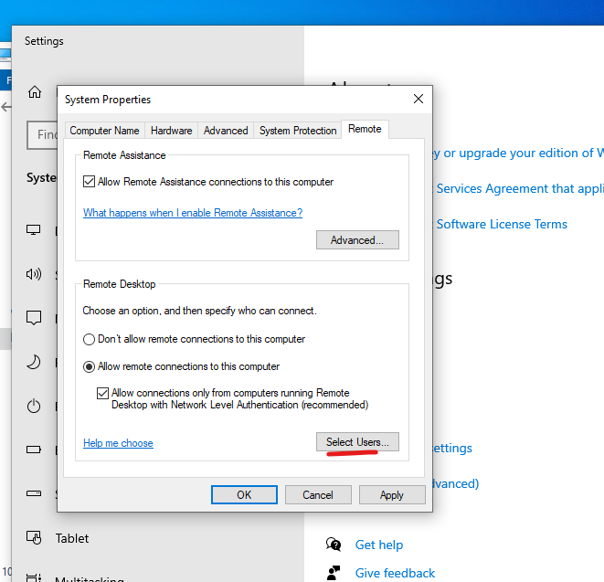

# Lab 9 – Lab 9 RSOP, Group Policy, Task Manager, and Disable Logoff

## Overview
This section of my home lab documentation focuses on configuring Group Policy, using RSOP (Resultant Set of Policy), managing Task Manager settings, and implementing a configuration to disable logoff in a Windows environment. The project demonstrates how to enforce specific policies across machines in a domain, monitor the effective policies using RSOP reports, and control system settings like logoff behavior and Task Manager access.

## Objectives
RSOP (Resultant Set of Policy): Use RSOP to generate reports on the effective policies applied to computers and users.
Group Policy Configuration: Create and configure Group Policies to enforce specific settings across domain-joined computers, including logoff policies and Task Manager access.
Task Manager Management: Customize Task Manager settings to control access, visibility, and processes for users in the domain.
Disable Logoff: Configure policies to disable logoff on domain-joined machines, ensuring users remain logged in for administrative purposes.
Policy Troubleshooting: Troubleshoot and resolve policy application issues using RSOP and Group Policy tools.

---

## Documentation
In this home lab, we will use RSOP commands, Group Policy Management, Task Manager, and disable logoff functionality. First, let's start by disabling Task Manager.

To do this, open Server Manager on your Windows Server 2022 account. Then, select Tools and click on Group Policy Management. In the Group Policy Management console, select Group Policy Objects under the SimoTech.com domain. From here, we can configure the Group Policy to disable Task Manager.

Next, right-click on Group Policy Objects and select New. Name the new policy "Task Manager". After creating it, select the Task Manager policy under Group Policy Objects. Then, go to the Delegations tab and select Add. Add Bob to grant him the necessary permissions for this policy.

Right-click on Task Manager, select Edit, then go to User Configuration → Administrative Templates → System. Next, select Ctrl+Alt+Del Options.

Here we will enable “Remove Change Password” and “Remove Task Manager”

Then back on the Group Policy Management, grab the “Task Manager” and move it to “HR”. Select “Yes”

Select “Enforced” by right-clicking on it.

Now, on Bob's account on Desktop2, open CMD and type the command gpupdate /force. This will immediately refresh the Group Policy settings for both the computer and user accounts.

After updating the Group Policy on Bob's computer, right-click on the taskbar, and you'll see that Task Manager is now greyed out, indicating that access has been successfully disabled.

If we press Ctrl+Alt+Del on the virtual machine, we will see that the Change Password option has been removed, reflecting the changes made through Group Policy.

To check which group policies have been applied to Bob's computer, open the command line and type gpresult /r. This will display the results of the Group Policy settings for both the computer and user accounts.

If you type taskmgr in the command line, a prompt will appear stating that Task Manager is disabled, confirming that the Group Policy to disable Task Manager has been successfully applied.

If you run Command Prompt as Administrator and then type taskmgr, Task Manager should open, as administrative privileges can bypass the policy restrictions applied to regular users.

To generate a Group Policy report, go to Group Policy Management, right-click on Group Policy Results, and select Group Policy Results Wizard.... This will guide you through the process of generating a detailed report on the applied Group Policy settings.

Click Next, then select Another Computer and click Browse. Type in Desktop2 and select it, then click Next to proceed with generating the Group Policy report for that computer.

Select SimoTech\Bob, click Next, and then click Finish. This will generate a report for Bob's Group Policy settings.

If you select the Details tab at the top of the report, it will display all of the policies that have been applied to Bob's account, giving you a detailed view of the Group Policy settings.

---

Congratulations! We have successfully leveraged RSOP commands, explored Group Policy settings, utilized Task Manager, disabled logoff functionality, removed the ability to change passwords, and restricted access to Task Manager.

👉 Next Lab 10 : Installing and Deploying Software with PDQ

